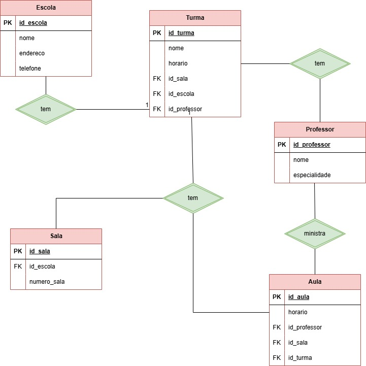

## Modelagem de Escola

## Regra de Negócio/Requisitos
Uma Escola tem várias turmas. Uma turma tem vários professores, sendo que um professor pode ministrar aulas em mais de uma turma.  Uma turma tem sempre aulas na mesma sala, mas uma sala pode estar associada a várias turmas (com horários diferentes). 

# Modelo Conceitual (DER)

[Voltar](../../README.md)